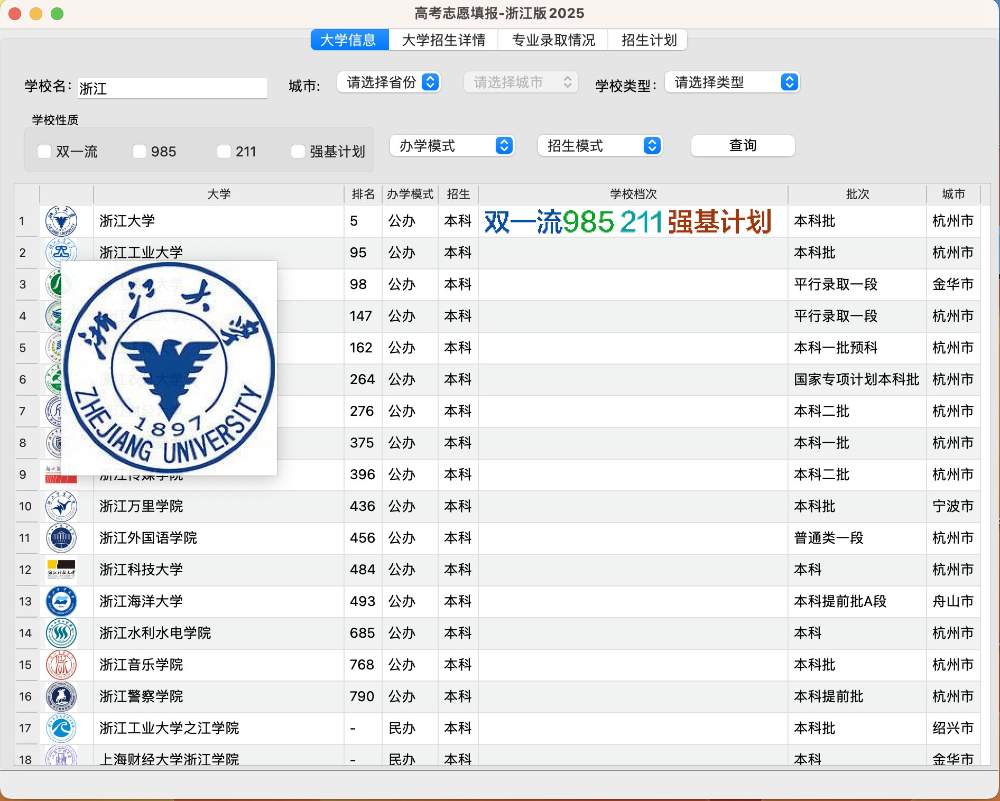
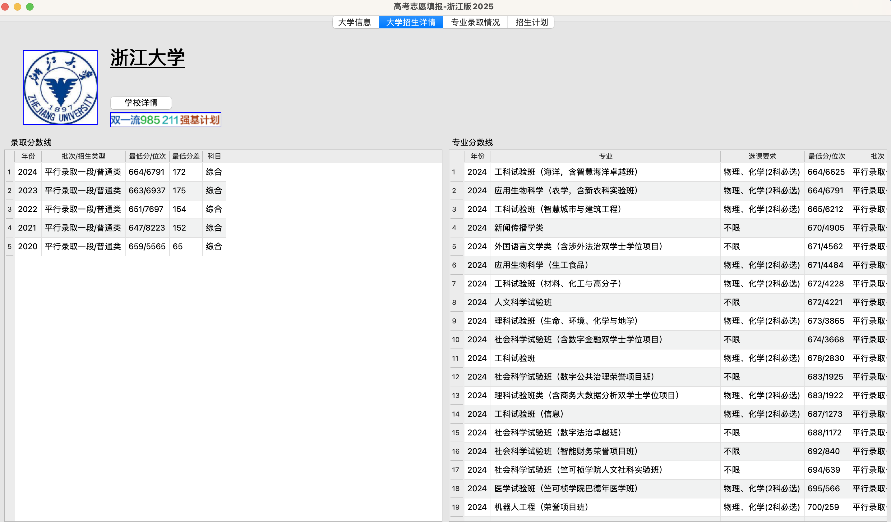
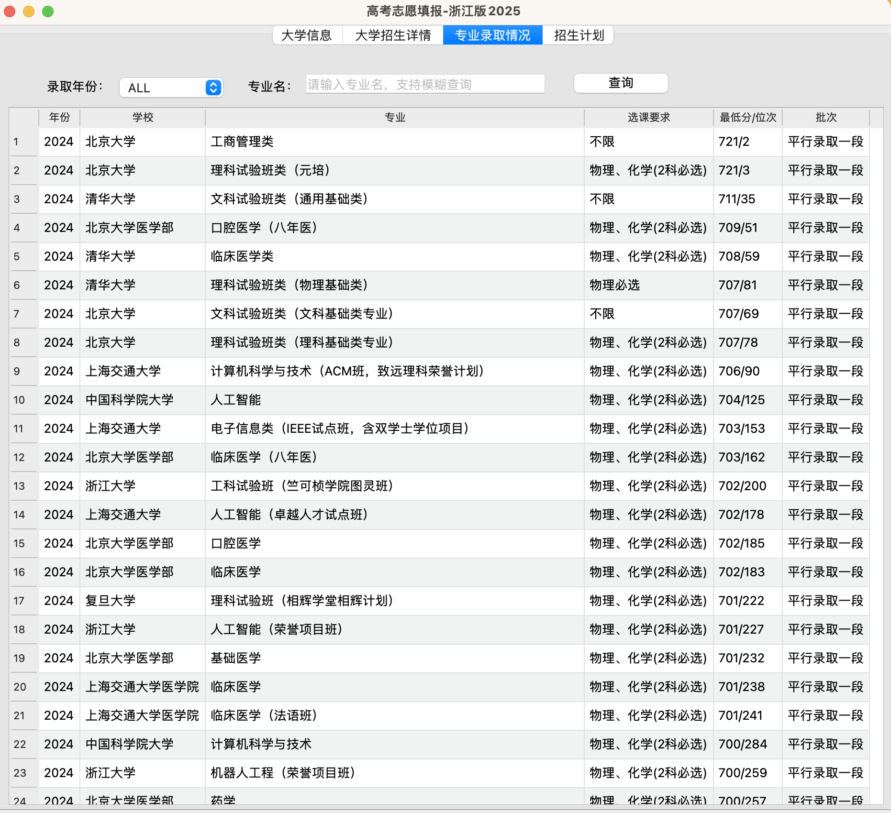
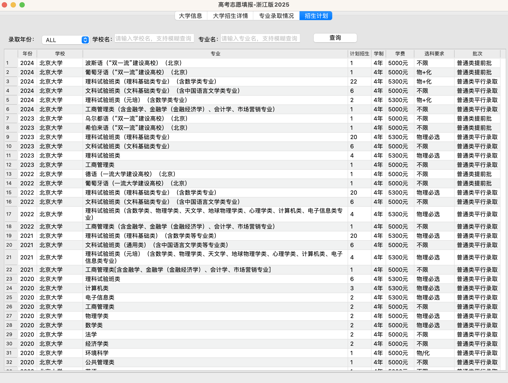

# 高考志愿报名助手
## 介绍
本项目是一个高考志愿报名助手，用于获取各高校近5年的国内高校录取信息，包括高校的简介、各专业的录取分数线、录取人数、学费等信息，并将信息保存到数据库中，以便用户查询。同时提供一个桌面应用程序，用于查询各高校录取分数线、录取人数、学费等信息。
## 功能
1. 获取各高校近5年的国内高校录取信息，包括高校的简介、各专业的录取分数线、录取人数、学费等信息。
2. 将信息保存到sqlite数据库中，以便用户查询。
3. 根据条件查询各高校信息，包括高校的名称、排名、办学模式、招生方式、学校档次（985、211、强基计划、双一流）、招生批次、所在城市等信息。双击之后进入该高校招生情况页面。
4. 根据高校名字查询高校招生情况，包括历年录取分数线（年份、批次/招生类型、最低分/位次、最低分差、科目）、专业分数线（年份、专业、选课要求、最低分/位次、批次）。双击专业分数线表格中的额信息可自动跳转该专业所有高校的录取情况。
5. 根据专业名称查询所有高校的录取情况，包括年份、学校、专业、选课要求、最低分/位次、批次。双击其中的记录可进入该高校、该专业的招生计划页面。
6. 根据高校和专业查询招生计划，包括年份、学校、专业、计划招生、学制、学费、学科要求、批次。

## 系统设计
### 数据库设计
1. 高校信息表college_info。
```
create table college_info
(
    id           INTEGER
        primary key autoincrement,
    logourl      TEXT, -- logo图片url
    college_name TEXT, -- 高校名称
    rankTypeShow TEXT, -- 排名类型显示
    rankType     TEXT, -- 排名类型
    rank         TEXT, -- 排名
    globalRank   TEXT, -- 全球排名
    uniqueRank   TEXT, -- 唯一排名
    province     TEXT, -- 省份
    city         TEXT, -- 城市
    location     TEXT, -- 地点
    school_type  TEXT, -- 学校类型，综合类、理工类。。
    education    TEXT, -- 学历，本科/专科
    nature       TEXT, -- 办学模式，公办/民办
    batch        TEXT, -- 招生批次
    score_city   TEXT, -- 招生城市
    score_list   TEXT, -- 招生分数线
    tag          TEXT, -- 标签 985、211、强基计划、双一流
    logo         BLOB  -- base64编码后logo图片
);

```
2. 学校简介表college_detail。
```
create table college_detail
(
    id        INTEGER
        primary key autoincrement,
    school_id TEXT,
    name      TEXT,
    detail    TEXT
);
```
3. 录取分数线表schoolscore。
```
create table schoolscore
(
    id            INTEGER
        primary key autoincrement,
    legalName     TEXT,
    province      TEXT,
    year          TEXT,
    curriculum    TEXT,
    batchName     TEXT,
    enrollType    TEXT,
    minScore      TEXT,
    minScoreOrder TEXT,
    minCha        TEXT,
    enrollNum     TEXT
);
```
4. 专业分数线表majorscore。
```
create table majorscore
(
    id                    INTEGER
        primary key autoincrement,
    legalName             TEXT,
    majorName             TEXT,
    province              TEXT,
    year                  TEXT,
    curriculum            TEXT,
    batchName             TEXT,
    tags                  TEXT,
    minScore              TEXT,
    minScoreOrder         TEXT,
    simpleMajorName       TEXT,
    majorNameDesc         TEXT,
    simplifySpecialCourse TEXT,
    specialCourse         TEXT,
    majorGroup            TEXT
);
```
5. 招生计划表college_plan。
```
create table college_plan
(
    id                INTEGER
        primary key autoincrement,
    legalName         TEXT,
    major_name        TEXT,
    province          TEXT,
    curriculum        TEXT,
    category          TEXT,
    year              TEXT,
    batch_name        TEXT,
    enroll_num        TEXT,
    tuition           TEXT,
    lengthOfSchooling TEXT,
    selectSubjects    TEXT
);
```
### 数据获取设计
数据入库部分采用python爬取网络公开数据库。
主程序为getdata2025.py。负责数据的爬取。
dbconn2025.py为数据库连接程序，供主程序调用。

#### dbbconn2025.py
```python
import sqlite3
class DBConn :
conn=None

	def __init__(self):
        # 连接数据库
		self.conn=sqlite3.connect("gaokao2025.sqlite")

	def execSql(self,sqlstr):
		curs=self.conn.cursor()

		curs.execute(sqlstr)

		self.conn.commit()

		curs.close()

	def execQuery(self,sqlstr):
		curs=self.conn.cursor()
		curs.execute(sqlstr)

		rows=curs.fetchall()

		curs.close()

		return rows
```
####  数据获取API
1. 获取学校清单。
```
https://gaokao.baidu.com/gk/gkschool/list?rn=10&pn=

参数说明：
rn---每页显示数量，默认为10
pn---页码，默认为1
```
返回结果：
```json
{
    "data":{
        "pageInfo":{
            "pn":1,
            "rn":2,
            "offset":0,
            "total":2911,
            "resNum":2,
            "hasNext":true
        },
        "ranking":{
            "tHead":[
                "排名说明",
                "大学",
                "2024录取分/位次"
            ],
            "tRow":[
                {
                    "loc":"https://www.baidu.com/10001_%E6%B5%99%E6%B1%9F_%E6%9C%AC%E7%A7%91%E6%8F%90%E5%89%8D%E6%89%B9B%E6%AE%B5_%E6%A0%A1%E5%8F%8B%E4%BC%9A",
                    "logo":"https://static-data.gaokao.cn/upload/logo/31.jpg?t=1732842537",
                    "url_xcx_params":{
                        "xcx_appkey":"97luawUa4at5F5r9N0FTQ2bGgoudzNRk",
                        "xcx_path":"/okam/pages/schoolhome/index",
                        "xcx_query":"tab=intro\u0026word=%E5%8C%97%E4%BA%AC%E5%A4%A7%E5%AD%A6",
                        "xcx_from":"1081000900000000",
                        "default_url":"https://gaokao.baidu.com/okam/pages/schoolhome/index?tab=intro\u0026word=%E5%8C%97%E4%BA%AC%E5%A4%A7%E5%AD%A6"
                    },
                    "h5Url":"https://gaokao.baidu.com/okam/pages/schoolhome/index?tab=intro\u0026word=%E5%8C%97%E4%BA%AC%E5%A4%A7%E5%AD%A6",
                    "college_name":"北京大学",
                    "rankTypeShow":"校友会",
                    "rankType":"1",
                    "rank":"1",
                    "globalRank":"-",
                    "uniqueRank":"1",
                    "province":"北京",
                    "city":"北京市",
                    "location":"北京",
                    "school_type":"综合类",
                    "education":"本科",
                    "nature":"公办",
                    "batch":"本科提前批B段",
                    "score_city":"浙江",
                    "score_list":[
                        "综 707/78"
                    ],
                    "tag":[
                        "双一流",
                        "985",
                        "211",
                        "强基计划"
                    ]
                },
                {
                    "loc":"https://www.baidu.com/10003_%E6%B5%99%E6%B1%9F_%E6%9C%AC%E7%A7%91%E6%8F%90%E5%89%8D%E6%89%B9_%E6%A0%A1%E5%8F%8B%E4%BC%9A",
                    "logo":"https://static-data.gaokao.cn/upload/logo/140.jpg?t=1731483780",
                    "url_xcx_params":{
                        "xcx_appkey":"97luawUa4at5F5r9N0FTQ2bGgoudzNRk",
                        "xcx_path":"/okam/pages/schoolhome/index",
                        "xcx_query":"tab=intro\u0026word=%E6%B8%85%E5%8D%8E%E5%A4%A7%E5%AD%A6",
                        "xcx_from":"1081000900000000",
                        "default_url":"https://gaokao.baidu.com/okam/pages/schoolhome/index?tab=intro\u0026word=%E6%B8%85%E5%8D%8E%E5%A4%A7%E5%AD%A6"
                    },
                    "h5Url":"https://gaokao.baidu.com/okam/pages/schoolhome/index?tab=intro\u0026word=%E6%B8%85%E5%8D%8E%E5%A4%A7%E5%AD%A6",
                    "college_name":"清华大学",
                    "rankTypeShow":"校友会",
                    "rankType":"1",
                    "rank":"2",
                    "globalRank":"-",
                    "uniqueRank":"2",
                    "province":"北京",
                    "city":"北京市",
                    "location":"北京",
                    "school_type":"综合类",
                    "education":"本科",
                    "nature":"公办",
                    "batch":"本科提前批",
                    "score_city":"浙江",
                    "score_list":[
                        "综 707/81"
                    ],
                    "tag":[
                        "双一流",
                        "985",
                        "211",
                        "强基计划"
                    ]
                }
            ],
            "rankDescription":{
                "showTag":"院校排名",
                "title":"院校排名说明",
                "value":[
                    {
                        "text":"数据源为",
                        "type":"text"
                    },
                    {
                        "text":"2024校友会中国大学排名（总榜）",
                        "type":"link",
                        "url":"http://www.chinaxy.com/2022index/news/news.jsp?information_id=10972",
                        "url_di":"f15d47d984e67e81",
                        "url_nsrc":"IlPT2AEptyoA_yixCFOxXnANedT62v3IEQGG_ytQ_zSvlVTte4viZQRAEG3hAn_MJ5DlgTCcfspGg7GdWThznd2Zhu5oxmhNki3vurqpsdHXUcpytdV6O0KTGHlvoq"
                    },
                    {
                        "text":"由",
                        "type":"text"
                    },
                    {
                        "text":"中国教育在线·掌上高考",
                        "type":"link",
                        "url":"https://www.gaokao.cn/",
                        "url_di":"158483f8df7c079e",
                        "url_nsrc":"IlPT2AEptyoA_yixCFOxCGZb8c3JV3T5AAGGQmBT1zW-nE0te4qaUb3"
                    },
                    {
                        "text":"核实整理后在百度公开发布。具体排名信息及计算方式可参考",
                        "type":"text"
                    },
                    {
                        "text":"艾瑞深校友会网",
                        "type":"link",
                        "url":"http://www.cuaa.net/",
                        "url_di":"c13dfa59c4ddbd3f",
                        "url_nsrc":"IlPT2AEptyoA_yixCFOxXnANedT62v3IEQGG_ytF1zf5o5ijva02"
                    },
                    {
                        "text":"。",
                        "type":"text"
                    }
                ]
            }
        },
        "schoolPkOperate":{
            "auto_stretching":{
                "img":"https://b.bdstatic.com/searchbox/image/gcp/20210519/1254195429.jpg",
                "validTime":"5"
            },
            "h5Url":"https://gaokao.baidu.com/okam/pages/school-compare/index",
            "icon":"https://b.bdstatic.com/searchbox/image/gcp/20210525/2104716035.png",
            "url_xcx_params":{
                "xcx_appkey":"97luawUa4at5F5r9N0FTQ2bGgoudzNRk",
                "xcx_from":"1081000900000000",
                "xcx_path":"/okam/pages/school-compare/index",
                "xcx_query":"word="
            }
        }
    },
    "errno":0,
    "msg":"success",
    "qid":"13844448950122249453"
}
```
2. 学校分数线
```
"https://gaokao.baidu.com/gk/gkschool/schoolscore?curriculum=3%2B3综合&"

# 参数说明
curriculum: 3+3综合
school: 学校中文名
province: 省份中文名
year:年份

```
返回结果:
```json
{
    "data":{
        "school_score":{
            "title":"录取分数线",
            "options":[
                {
                    "text":"浙江"
                },
                {
                    "text":"2024"
                },
                {
                    "text":"3+3综合"
                }
            ],
            "titles":[
                {
                    "text":"批次/招生类型",
                    "fields":"batchName,enrollType"
                },
                {
                    "text":"最低分",
                    "fields":"minScore"
                },
                {
                    "text":"位次",
                    "fields":"minScoreOrder"
                }
            ],
            "dataList":[
                {
                    "loc":"http://dps.baidu.com/data/education_college_admission_score/ef7122cd129c4608840a165791ac0d14_education_college_admission_score_aladdin",
                    "legalName":"浙江大学",
                    "province":"浙江",
                    "year":"2024",
                    "curriculum":"综合",
                    "batchName":"平行录取一段",
                    "enrollType":"普通类",
                    "minScore":"664",
                    "minScoreOrder":"6791",
                    "minCha":"172",
                    "enrollNum":""
                }
            ],
            "isNewGK":true,
            "showType":"0",
            "score_msg":"分数未公布或未招生，请切换其它选项查看",
            "pageInfo":{
                "pn":1,
                "rn":20,
                "offset":0,
                "total":1,
                "resNum":1,
                "hasNext":false
            },
            "h5Url":"https://gaokao.baidu.com/okam/pages/schoolhome/index?anchor=school\u0026curriculum=3%2B3%E7%BB%BC%E5%90%88\u0026gkfrom=card\u0026province=%E6%B5%99%E6%B1%9F\u0026tab=score\u0026word=%E6%B5%99%E6%B1%9F%E5%A4%A7%E5%AD%A6\u0026year=2024",
            "url_xcx_params":{
                "xcx_appkey":"97luawUa4at5F5r9N0FTQ2bGgoudzNRk",
                "xcx_path":"/okam/pages/schoolhome/index",
                "xcx_query":"anchor=school\u0026curriculum=3%2B3%E7%BB%BC%E5%90%88\u0026gkfrom=card\u0026province=%E6%B5%99%E6%B1%9F\u0026tab=score\u0026word=%E6%B5%99%E6%B1%9F%E5%A4%A7%E5%AD%A6\u0026year=2024",
                "xcx_from":"1081000900000000"
            }
        }
    },
    "errno":0,
    "msg":"success",
    "qid":"7239057243511025892"
}
```
3. 专业分数
```
https://gaokao.baidu.com/gk/gkschool/majorscore?rn=10&curriculum=&subject=&sortType&version=2&needFilter=1&school=宁波大学&province=浙江&year=2024&pn=1

# 参数说明
rn: 获取数量
pn-第几条记录开始，
query-中文学校名，province-省，year-年份,curriculum-课程类型,3+3综合,rn-每页记录数
```

4. 招生计划
```
https://gaokao.baidu.com/gk/gkschool/getrecruitingscheme?curriculum=3%2B3综合
# 参数说明
rn: 获取数量
pn-第几条记录开始，
query-中文学校名，province-省，year-年份,curriculum-课程类型,3+3综合,rn-每页记录数

```

#### 程序接口
- insertSchoolScore
数据插入数据库接口
- getAllSchool
获取所有学校
- insertSchoolScore
获取所有学校分数线
- getMajorScoreNear5Byhread
通过5个线程获取专业分数线
- getCollegePlan
获取获取招生计划
#### 运行测试环境
python3.9.20

### 主程序设计
#### 大学信息

#### 大学招生信息

#### 专业录取信息

#### 招生计划
